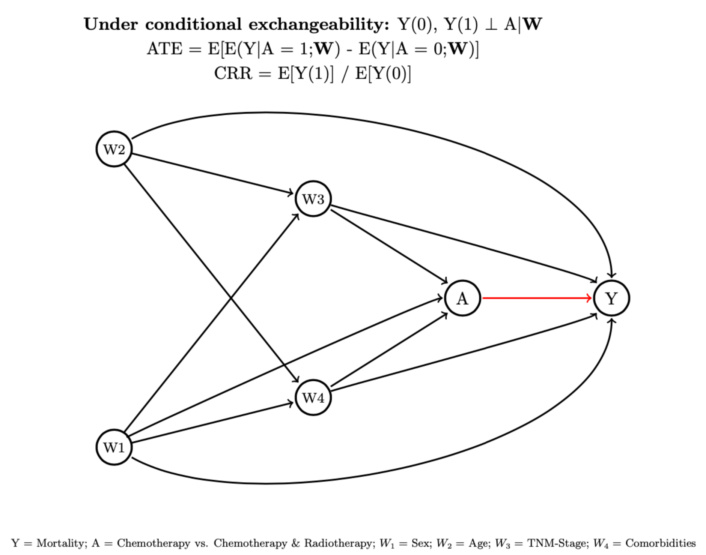
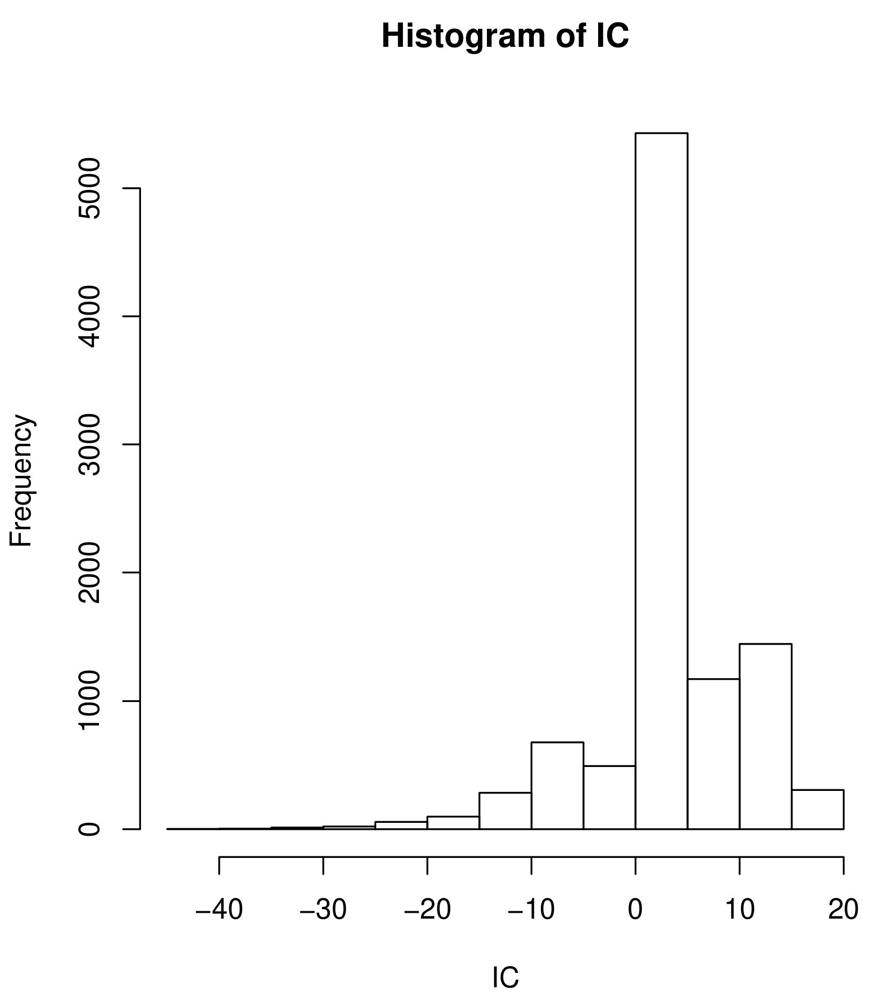

<a href="https://twitter.com/share?ref_src=twsrc%5Etfw" class="twitter-share-button" data-show-count="false">Tweet</a><script async src="https://platform.twitter.com/widgets.js" charset="utf-8"></script>

(https://zenodo.org/badge/latestdoi/185887587

```{r options, echo=FALSE, eval=FALSE}
options(scipen=999, digits=5, tinytex.verbose = TRUE)
```

# Abstract

Approximate statistical inference via determination of the asymptotic distribution of the statistics is a technique that epidemiologists and applied statisticians use routinely, we name it the classical delta-method, but there is a gap as it is not routinely taught and many applied researchers do not understand it neither its uses. The delta-method is a theorem which states that a smooth function of an asymptotically normal estimator is also asymptotically normally distributed. It can also be viewed as a technique for approximating the variance of a functional i.e., a nonlinear function of a random variable that can be approximated by averages. A fundamental problem in inferential statistics is to approximate the distribution of a statistic calculated from a functional derived from a transformation or the predictions from a regression model fitted parameters. Machine learning methods and causal inference problems applied to epidemiology requires to generate the point estimates from asymptotically linear parameters derived as functionals that are approximated by averages, but the standard error of these point estimates are not so easily calculated with analytical forms. Therefore, we need to approximate the distribution of the standard error for statistical inference using the functional delta-method based on the influence curve. The venue of new methods and techniques requires a constant update on valid statistical inference for applied epidemiologists and statisticians. In this tutorial we introduce the use of the classical and functional delta-method and its link to the Influence Curve in Epidemiology from a practical perspective. We provided a mostly applied overview of the classical and functional delta-method, the influence curve and the bootstrap including easy to understand R code and examples based on cancer epidemiology that may help to fill this gap. 

**Keywords**: Statistical inference; Bootstrap; Delta-method; Epidemiology; Causal Inference; Tutorial.

# Introduction

A fundamental problem in inferential statistics is to approximate the distribution of a statistic calculated from a probability sample of data. The statistic is usually a parameter estimate that characterizes the sampling variability of the estimate [@Boos2013]. Because the number and type of inference problems for which exact parametric distributions can be determined is limited the approximation of the distribution of the statistic is necessary. Approximate inference via determination of the asymptotic distribution of the statistics is a technique that epidemiologists and applied statisticians use routinely, we name it the delta-method. The delta-method is a theorem which states that a smooth function of an asymptotically normal estimator is also asymptotically normally distributed. It can also be viewed as a technique for approximating variance of a functional i.e., a nonlinear function of a random variable that can be approximated by averages [@Armi2005; @Boos2013]. 

Often in addition to reporting parameters fit by a model, we need to report some marginal asymptotically linear transformation of these parameters. The transformation can generate the point estimates of our desired values, but the standard error (SE) of these point estimates are not so easily calculated with analytical forms. Therefore, we need to approximate the distribution of the SE for statistical inference using the delta-method [@Boos2013] for large samples, or other computational methods such as the bootstrap [@Efron1993; @efron1982]. For instance, in epidemiology we use routinely the delta-method to compute the SE of functionals as the risk difference (RD), the risk ratio (RR), and the odds ratio (OR) [@Agresti2010].

More recently for causal inference we compute the average treatment effect (ATE) using G-computation, a generalization of the standardization, among other estimations techniques as the inverse probability of treatment weights [@Rubin2007]. The ATE is defined by an average which is a function of two random variables (i.e., the potential outcomes Y(1) and Y(0)) [@Rubin2007; @Gutman2015]. These two random variables are predicted from the coefficients of the parameters fitted in two different regression models [@robins1986]. The functional delta-method applied to an estimator implicitly defined by averages, also known as M-estimator, can be used to approximate the variance of the estimator (i.e., G-computation for the ATE) [@Boos2013; @kennedy2016; @kennedy2017] in addition to the bootstrap [@Efron1993; @efron1982]. Semi-parametric and Empirical Process theory is needed to estimate the SE of the ATE using the functional delta-method under some theoretical assumptions (i.e., the estimator used to derive the ATE must be pathwise differentiable and asymptotically regular and linear [@Boos2013; @kennedy2016; @kennedy2017]. We, applied statisticians and epidemiologists, should known how to determine when a large sample approximation to the distribution of a statistic is appropriate, how to derive the approximation, and how to use it for inference applications.

In this tutorial we introduce the use of the classical and functional delta-method and its link to the Influence Curve (IC) in Epidemiology from a practical perspective including boxes with code in R statistical software (R Foundation for Statistical Computing, Vienna, Austria) [@R2020] to allow readers learning by doing. In section two we introduce some basic notation for the delta-method and derive the SE for the a sample mean of an independent variable and the ratio of two means of two independent variables. In section three we derive the SE for the classical epidemiological measures of association. In section four we introduce an empirical example to derive the SE for a single proportion, the conditional odds ratio and relative risk, and finally a marginal causal risk ratio estimated using the augmented inverse probability of treatment weights estimator. Then, in section five we contrast the functional delta-method with the bootstrap approach and finish the article in section five with some applied conclusions.

# The delta-method

## The classical delta-method

Essentially, the delta-method involves calculating the expansion up to the first order of a Taylor series approximation of a function (f) [@Herberg1962] to derive the empirical value and the SE of an estimator (See appendix for the delta-method theorem from Serfling, 1980, Ch.3). When a statistic can be approximate by an average, the approximating average is usually an average of some function (f) of the sample values and can be written in the form:


\[f(\hat\theta)-f(\theta)\;\approx\;f'(\theta)(\hat\theta\,-\,\theta)\,+\,\text{Op}\left(\frac{1}{\sqrt(n)}\right) .\]

Where \(f(\hat\theta))\) can be interpreted as the large sample stochastic limit of \((f(\theta))\) and \(f'(\theta)(\hat\theta\,-\,\theta)\) is a function called the
Influence Curve (IC). The remainder \(\text{Op}(\frac{1}{\sqrt(n)})\) is
negligibly small as the sample size increases as asymptotically converges to zero [@Boos2013].

So the remainder converges to zero

\[\text{Op}\left(\frac{1}{\sqrt(n)}\right) \rightarrow 0 \;,\text{and}\]

the distribution of the \(\theta\) converges in probability to a normally distributed
random variable with mean zero and finite variance when the sample size n goes to infinity.

\[\sqrt(n)\left(f(\hat\theta)-f(\theta)\right)\; \rightarrow N(0\,,var(\theta)).\]

Therefore, suppose that \((\hat\theta)\) is a sample mean and f is a smooth scalar valued function. Then, the mean of an estimator \(f(\hat\theta)\) can be approximate with the population mean \(f(\theta)\) plus the IC estimated as the first derivative of the estimator times the difference between the sample population mean minus the mean of the estimator approximated using the delta-method:

\[f(\hat\theta) \approx\;f(\theta)\,+\,f'(\theta)(\hat\theta\,-\,\theta)\;(1)\]

Then we have for the sample mean

\[f(\bar{Y}) \approx\; f(\mu)\,+\,f'(\mu)(\bar{Y}\,-\,\mu)\,=\, n^{-1} \sum\, (\mu)\,+\,f'(\mu)(\bar{Y_{i}}\,-\,\mu),\]

Now lets suppose that we want to consider a pair of independent identically distributed (iid) random sample means (i.e., Y1 and Y2) and we want to derive the SE for the ratio estimator \((f(\bar{Y})\,=\,\bar{Y}_{1}/\bar{Y}_{2})\) where \((\mu_{2}\neq\,0)\). In this case the IC for the ratio will be estimated as follows:

\[f'(\mu)\,=\, \frac{1}{\mu_{1}}\,-\,\frac{\mu_{1}}{\mu_{2}^{2}}.\] 

Therefore the IC is given

\[IC = \frac{1}{\mu_{1}}{}(\bar{Y}_{i1}\,-\,\mu_{1})\,-\,\frac{\mu_{1}}{\mu_{2}^{2}}(\bar{Y}_{i2}\,-\,\mu_{2})\]


## The functional delta-method

A function in mathematical statistics is defined by a rule, which associates a number with a function of one or several variables (i.e, the predictions of the linear combinations of the coefficients from regression models). In order to explore the properties of the functionals a generalization of the (ordinary or partial) derivative is required, named the functional derivative. It can be defined via the variation \(\delta f\) of the functional which results from variation of the function by \(\delta f\). Thus, it implies that the function must be differentiable and asymptotically linear (i.e, continuous). 

When we have more than two iid random variables that map to a function, we also get the Taylor series approximation of the function using the first two terms of the expansion of a functional about the mean, but we need to compute a vector of partial derivatives along one direction of the functional. We can then take the variance of this approximation to estimate the variance of \(\boldsymbol\theta\) and thus the SE of a transformed functional parameter. The first two terms of the Taylor expansion are then an approximation for \(\boldsymbol{\hat\theta}\) as follows:

\[f(\boldsymbol{\hat\theta}) \approx\, f(\boldsymbol\theta) \,+\,\nabla(\boldsymbol\theta)^T\,(\boldsymbol{\hat\theta}\,-\,\boldsymbol\theta)\; (2).\]


\[\text{Var}(\boldsymbol{\hat\theta}) \approx\; \nabla(\boldsymbol\theta)\text{Cov}(\boldsymbol\theta) \nabla(\boldsymbol\theta)^{T}\; (3).\]


Where Cov(\(\boldsymbol\theta\)) is the variance-covariance matrix of \(\theta\) [@Boos2013]. The variance formula in (3) is also known as the "Huber Sandwich Estimator" that often is used to estimate the variance of the maximum likelihood estimation when the underlying model is misspecified. [@Fredman2006] In summary, for an observed data \(\text{O}_i\), (i = 1, $\ldots$, n) an asymptotically linear estimator of \(\hat\theta\) can be evaluated as follows:

\[\hat\theta\;=\;\theta\,+\,\frac{1}{\sqrt{n}}\sum_{i=1}^n (\text{IC}_{i})\,+\,\text{Op}(\frac{1}{\sqrt(n)})\,.\]

Where \(\theta\) is the plug-in estimator of a real value differentiable function (i.e., empirical sample mean) evaluated at \(\theta\) plus the IC represented as the sample mean of a fixed function plus a remainder term that must converge to 0 at a rate faster than \(\frac{1}{\sqrt{n}}\). [@Vaart98] Note that the IC measures the influence of the sample observations on the estimator. Plotting the IC provides a tool to discover outliers and tells us how robust is the estimator. Most importantly, the estimated IC provides an asymptotic variance estimate for the asymptotically linear estimator. Therefore, we can readily apply the \textbf{Central Limit Theorem} (CLT) to compute \emph{Wald} type confidence intervals [CI]).[@van2011]

In box 1 we compute the SE for a sample mean using the classical delta-method based on the IC and we compare the results with the delta-method implementation of the R package MSM [@kavroudakis2015].

**Box 1. Delta-method for the sample mean and IC visualization in R**

```{r, message = FALSE}
# M-estimation for the sample mean
# Data generation
set.seed(7777)
n <- 1000
x <- runif(n,0,1)
mx = mean(x)

# Functional delta-method: influence curve for the sample mean (first derivative=1(constant))
IC = 1 * (x - mx)

# M-estimation of the sample mean
Yhat <- x + IC # Pluging estimator
Yhat <- mean(Yhat); Yhat

# Geometry of the IC
plot(x, IC)

# Standard Error: Influence Curve
varYhat.IC <- var(IC)/n;
seIC <- sqrt(varYhat.IC)

# Asymptotic linear inference 95% Confidence Intervals
Yhat_CI <- c(mean(Yhat) - 1.96*sqrt(varYhat.IC), mean(Yhat) + 1.96*sqrt(varYhat.IC)); 
mean(Yhat); Yhat_CI

# Check with implemented delta-method in library MSM 
library(msm)
se = deltamethod(g= ~x1, mean= mx, cov= varYhat.IC)
print(se)
seIC

# Check 95%CI delta-method computed by hand with delta-method implemented in RcmdrMisc library
Yhat_CI <- c(mean(Yhat) - 1.96*sqrt(varYhat.IC), mean(Yhat) + 1.96*sqrt(varYhat.IC)); 
mean(Yhat); Yhat_CI

library(RcmdrMisc)
DeltaMethod(lm(x ~ 1), "b0")
```

# Classical delta-method for common measures of association in epidemiology

We use the classical 2 by 2 epidemiological table, presenting outcome counts by the levels of a risk factor, to derive the SE for the risk differences (RD), risk ratio (RR), and odds ratio (OR) using the delta-method.

| Risk      | Alive | Dead |
|-----------|-------|------|
| Exposed   | $n_{11} = (p_1)$     | $n_{21} = (p_2)$    |
| Unexposed | $n_{12} = (1-p_1)$     | $n_{22} = (1-p_2)$    |
| N         | $N_1$     | $N_2$    |

## Risk Difference

The risk difference (RD) is defined as follows [@Rothman2008]:

\[\widehat{RD} \,=\, \hat \theta_{1}\,-\,\hat \theta_{2} \,=\, \hat p_{1}\,-\,\hat p_{2}.\]

Assuming that the probability of the event (\textbf{p}) can be modelled
using a Binomial distribution with range \(0\;\leq \text{p} \leq\;1\),
expectation of p is E(\(\theta\)) = p, and the variance var(\(\theta\)) = p(1-p)/ n [@Rothman2008]. 

Using the delta-method in (1) and substituting \((\hat\theta\,-\,\theta)\) for the variance of \(theta\) i.e., var(\(\theta\)) = p(1-p)/ n,  we can derive the  \(SE(\widehat{RD})\) for a single proportion computing the IC of the risk difference as follows:

\[SE(\widehat{RD}\,=f'(\theta)(var(\theta))\;=\; 1\,\times\,\sqrt{\frac{p(1-p)}{n}}\]

Therefore, to estimate the var(\(\widehat{RD}\)) for the risk differences we sum the variances var(\(\hat \theta_{1})\) + var\((\hat\theta_{2})\) as follows:


\[SE(\widehat{RD})\,=\, \sqrt{\frac{(1-\hat p_{1})}{n_{1}}}\,+\,\sqrt{\frac{(1-\hat p_{2})}{n_{2}}}\,=\,\sqrt{\frac{(1-\hat p_{1})}{n_{1}}\,+\,\frac{(1-\hat p_{2})}{n_{2}}}\]

## Risk Ratio


Similarly to estimate the SE for risk ratio (RR) we have

\[\widehat{RR} \,=\, \frac{\hat \theta_{1}}{\hat \theta_{2}} \,=\, log\left(\frac{\hat p_{1}}{\hat p_{2}}\right)\,=\,log(\hat p_{1}) + log(\hat p_{2})\]

Note that the derivative of the log(p) is equal to 1/p.

Then, 
\[SE(log(\hat{\theta}))\,=f'(\theta)(var(\theta))\;=\;\frac{1}{p}\sqrt{\frac{p(1-p)}{n}}\,=\,\sqrt{\frac{(1-p)}{pn}},\; and\]

\[SE(log(\widehat{RR}))\,=\, \sqrt{\frac{(1-\hat p_{1})}{\hat p_{1}n_{1}}}\,+\,\sqrt{\frac{(1-\hat p_{2})}{\hat p_{2}n_{2}}}\,=\,\sqrt{\frac{(1-\hat p_{1})}{\hat p_{1}n_{1}}\,+\,\frac{(1-\hat p_{2})}{\hat p_{2}n_{2}}}\]

## Odds Ratio

Similarly to estimate the SE for odds ratio (OR) we have

\[\widehat{OR} \,=\, \frac{\hat \theta_{1}}{\hat \theta_{2}} \,=\, log\left(\frac{\hat p_{1}/(1-\hat p_{1})}{\hat p_{2}/(1-\hat p_{2})}\right)\,=\,log\left(\frac{\text{n}_{11}\text{n}_{22}}{\text{n}_{12}\text{n}_{21}}\right)\,,\]

Note that the log of the odds \(\frac{p}{1-p}\) is equal to the log(p) - log(1-p) and therefore the derivative is \(\frac{1}{p(1-p)}\).

Then,

\[\text{SE}(log(\hat{\theta}))\,=\,f'(\theta)(var(\theta))\;=\;\frac{1}{p(1-p)}\sqrt{\frac{p(1-p)}{n}}\,=\,\sqrt{\frac{1}{n}}\;, and\]


\[\text{SE}(log(\widehat{OR}))\,=\, \sqrt{\frac{1}{n_{11}}\,+\,\frac{1}{n_{12}}\,+\,\frac{1}{n_{21}}\,+\,\frac{1}{n_{22}}}\]

Finally, after applying the delta-method and assuming the asymptotical linear properties for the estimators of the variance for the different measures of association, we can readily apply the \textbf{CLT} and therefore to derive type Wald 95\% CI (i.e., 1.96 \( \times\; \text{SE}\; (\hat\theta)\)) for the different epidemiological measures of association.

# Empirical example

To illustrate the use of the delta-method we simulate data based on a cancer epidemiology example. We want to estimate the effect of the presence of comorbidities (binary indicator) on one-year cancer mortality in cancer patients controlling for the confounding effect of age in a cohort of 1,000 individuals in their middle age. We assume that it is an extremely lethal type of cancer (i.e., pancreatic cancer) thus we can expect high one-year mortality rate. Age in years was generated as a normal random variable with mean 65 years and standard deviation of 5 years. Comorbidities was generated as a binary indicator and as a function of age using a binomial model. Patients one-year mortality rate was generated as a function of the patients age and the presence of comorbidities using a binomial distribution. The data generation and models specifications are provide here below in the box 2.

**Box 2. Data generation**

```{r}
# Data generation
generateData <- function(n, seed){
    set.seed(seed)
    age <- rnorm(n, 65, 5)
    cmbd <- rbinom(n, size=1, prob = plogis(1 - 0.05 * age))
    Y <- rbinom(n, size=1, prob = plogis(1 - 0.02* age - 0.02 * cmbd))
    data.frame(Y, cmbd, age)
}

# Describing the data
data <- generateData(n = 1000, seed = 777) 
str(data)
summarize(
  data,
  Status = mean(Y), 
  Comorbidities = mean(cmbd),
  Age =  mean(age)) 
```


## Delta-method for a singly proportion parameter

First, we would like to derive the SE for the single probability or risk
of death using the delta-method. In box 3, we compute the risk or probability of death base on the empirical 
sample example and its variance. We defined the probability of death as the functional \(f(\theta)\) = \(\hat p\). Then the first derivative of f is equal to one. So the variance of the risk of death can be estimated using:


\[ \text{Variance}(\hat{\text{p}}) \,=\,1\,\times\,\left(\frac{p(1-p)}{n}\right)\,.\]


**Box 3. Standard error for the single proportion parameter using the delta-method**

```{r}
# Risk of death
p_hat = mean(data$Y)
print(p_hat)

# Varianze for the risk of death
 n = nrow(data)
 var_p_hat = p_hat * (1 - p_hat) / n
 print(var_p_hat)

#This can be implemented in the following R code:
dev_p_hat = 1
se_risk = sqrt((dev_p_hat) * var_p_hat)
print(se_risk)

# To check that our results are consistent with the implementation of the
# delta-method function provide by the sms R package used for
# advanced Geographical Analysis.

library(msm)
se_risk_delta = deltamethod(g = ~ x1, 
                            mean = p_hat,         
                            cov  = var_p_hat)
print(se_risk_delta)

## Are the same se_risk and se_risk_delta?
if(se_risk == se_risk_delta) print("Yes")
``` 

## Delta method for the odds ratio derived from a regression model

We compute the SE for the odds ratio (OR) derived from a multivariate
binomial regression model. Note that the OR transformation is a
function of the regression coefficients from the model. First
we estimate the conditional probability of the risk of death for those
patients with comorbidities adjusting for age. The model summary is
described here below in box 3.1. The probability of death for a cancer patient in
our sample with comorbidities compared with a patient without
comorbidities and in average with the same age is approximately 40\%
higher:

**Box 3.1 OR estimation**

```{r}
m1 <- glm(Y ~ age + cmbd, data = data, family = binomial)
summary(m1)

b1 <- coef(m1)[3]
cat("One-year mortality risk for patients with comorbidities vs no comorbidities:") 
exp(b1)
```

We now can derive the SE for the OR using the equation (3) for the delta-method applied to the multivariate case. Note that the first derivative for the exponential function is equal to exponential and therefore the partial derivatives for age are all the same. Then, to get the matrix of the covariance of the parameter fitted in the model for age we use the command vcov in R (Box 3.2).

**Box 3.2 Delta-method for the OR derived from a multivariate regression model**

```{r}
grad <- exp(b1)
vcov(m1)

# Applying formula 3
vb1 <- vcov(m1)[3,3]
se <- grad %*% vb1 %*% grad
se_or <- as.vector(sqrt(se)); se_or

# Now, we have to check that our results are consistent with the
# implementation of the delta-method function provide by the sms
# R package 

se_or_delta <- deltamethod(~ exp(x1), b1, vb1); se_or_delta

# Are the same se_or and se_or_delta?
ifelse(
  se_or == se_or_delta,
  print("Yes"), print("No")
)
```

## Conditional risk ratio from a multivariate regression model

We computed the SE for the RR as the ratio of two probabilities derived from the predictions of a multivariate binomial regression model. First we fit the model with the binary indicator of one-year mortality as dependent variable and patients age and comorbidities as independent variables. Then, from the fitted model and using the \textbf{predict} function we derive the probability of death from pancreatic cancer among patients aged 45 years and with comorbidities versus patients aged 75 years old with no comorbidities. Finally, we compute the conditional RR as the ratio between both probabilities. The simulated risk of death in a population where cancer patients were aged 45 years with comorbidities is approximately 81.5\% higher than the risk of one-year mortality among cancer patients aged 75 years and with no comorbidities (we assume that the pancreatic cancer is more aggressive among young adults with comorbidities).


**Box 4.1. Standard error for the conditional risk ratio derived from a multivariate regression model**

```{r}
m2 <- glm(Y ~ age + cmbd, data = data, family = binomial)
p75 <- predict(m2, newdata = data.frame(age = 75, cmbd = 0), type="response")
p45 <- predict(m2, newdata = data.frame(age = 45, cmbd = 1), type="response")
rr <- p45 / p75;
cat("Conditional risk ratio: ", rr)
```

Note that the relative risk transformation is a function of the regression coefficients from the model. Thus, in order to compute the SE for the RR, we should define the conditional probability in terms of the regression coefficients. So, the one year probability of death, given patients age and comorbidities is computed as follows:

\[ \text{P(Y=1|\textbf{W})}\,=\,\frac{1}{1\,+\,\text{exp}(-\sum_{i=1}^{k} \beta(\textbf{w}))}\]

Where k is the number of parameters in the model \(\beta\,=\,(\beta_{0},\beta_{1},\beta_{2})\) and \textbf{W} represents the vector of covariates represented for the \(\beta\) parameters (one for each covariate, i.e., \(\beta_{1}\; and\; \beta_{2}\, \text{for patients age and comorbidities, respectively})\), plus the intercept \(\beta_{0}\). Therefore, the probability of one-year mortality for cancer patients aged 45 years old with comorbidities is computed as follows: 


\[\text{P(Y = 1|w1 = 45, w3 = 1)}\,=\,\frac{1}{1\,+\,\text{exp}(-\beta_{0}\,-\,\beta_{1}\times 45\,-\,\beta_{2}\times 1)},\]


and the probability of one-year mortality for cancer patients aged 75 years with no comorbidities


\[\text{P(Y = 1|W2 = 75, W4 = 0)}\,=\,\frac{1}{1\,+\,\text{exp}(-\beta_{0}\,-\,\beta_{1}\times 75\,-\,\beta_{2}\times 0)}.\]


\noindent Now we can compute the RR as a function of the two previous probabilities. Note that w1 = 75 years, w2 = 45 years, w3 = comorbidities and w4 = no comoribidities)

\[\text{f(w)}\,=\,\frac{\frac{1}{1\,+\,\text{exp}(-\beta_{0}\,-\,\beta_{1} w1\,-\,\beta_{2} w3)}}{\frac{1}{1\,+\,\text{exp}(-\beta_{0}\,-\,\beta_{1} w2\,-\,\beta_{2} w4)}},\]


which simplifies to

\[\text{f(w)}\,=\,\frac{1\,+\,\text{exp}(-\beta_{0}\,-\,\beta_{1} w2\,-\,\beta_{2} w4)}{1\,+\,\text{exp}(-\beta_{0}\,-\,\beta_{1} w1\,-\,\beta_{2} w3)}.\]


We now need to solve the partial derivatives for f(w) using the product and chain rules. [@Wolfram92] However, we can use the online open source available software Wolfram alpha \url{https://www.wolframalpha.com/} to readily get the result of the partial derivatives.[@Wolfram92] Then, we apply formula (3) to derive the SE for the RR using the delta-method. 

The partial derivatives for f(w) using the product and chain rules are given here below:

\[\frac{\text{df}}{\text{d}\beta_{0}}\,=\,\text{-exp}(-\beta_{0}\,-\,\beta_{1}w2\,-\,\beta_{2} w4))\times \text{p}\,+\,(1\,+\,\text{-exp}(-\beta_{0}\,-\,\beta_{1} w2\,-\,\beta_{2} w4))\times \text{p}(1\,-\,\text{p}),\]

then,

\[\frac{\text{df}}{\text{d}\beta_{1}}\,=\,\text{-exp}(-\beta_{0}\,-\,\beta_{1}w2\,-\,\beta_{2} w4))\times w2 \times \text{p}\,+\,(1\,+\,\text{exp}(-\beta_{0}\,-\,\beta_{1} w2\,-\,\beta_{2} w4))\times x1 \times \text{p}(1\,-\,\text{p}),\]

and, 

\[\frac{\text{df}}{\text{d}\beta_{2}}\,=\,\text{-exp}(-\beta_{0}\,-\,\beta_{1}w2\,-\,\beta_{2} w4))\times w4 \times \text{p}\,+\,(1\,+\,\text{exp}(-\beta_{0}\,-\,\beta_{1} w3\,-\,\beta_{2} w4))\times w3 \times \text{p}(1\,-\,\text{p}).\]


where p is 

\[\text{P(Y=1|w1,w2)}\,=\,\frac{1}{1\,+\text{exp}(-\beta_{0}\,-\,\beta_{1}w1\,-\,\beta_{2} w3)},\]


i.e., the probability of one-year mortality for cancer patients aged 45 years with comorbidities. 


**Box 4.2 Delta-method to derive the SE for the conditional RR**

```{r}
#The partial derivative are computed in R as follows:
x1 <- 45
x2 <- 75
x3 <- 1
x4 <- 0
b0 <- coef(m2)[1]
b1 <- coef(m2)[2]
b2 <- coef(m2)[3]
e1 <- exp(-b0 - 45 * b1 - 1 * b2)
e2 <- exp(-b0 - 75 * b1 - 0 * b2)
p1 <- 1 / (1 + e1)
p2 <- 1 / (1 + e2)
dfdb0 <- -e2 * p1 + (1 + e2) * p1 * (1 - p1)
dfdb1 <- -x2 * e2 * p1 + (1 + e2) * x1 * p1 * (1 - p1)
dfdb2 <- -x4 * e2 * p1 + (1 + e2) * x3 * p1 * (1 - p1)
grad <- c(dfdb0, dfdb1, dfdb2)
vG <- t(grad) %*% vcov(m2) %*% (grad)
se_rr <- c(sqrt(vG));se_rr

#Now, we check whether the results are consistent with the msm R package. 
#We obtain the same results for the SE of the RR computed before (0.3653979)
se_rr_delta <- deltamethod( ~(1 + exp(-x1 -75*x2 -0*x3)) / (1 + exp(-x1 -45*x2 -1*x3)), 
             c(b0, b1, b2), 
             vcov(m2)
             ); se_rr_delta

#Finally, we compute the type Wald 95% CI
lb <- rr - 1.96*sqrt(vG)
ub <- rr + 1.96*sqrt(vG)
cat("\n Conditional Risk Ratio (95%CI): ") ; cat(rr, "(", lb,",", ub,")")
```

## Statistical inference for the causal risk ratio derived from the AIPTW estimator

Let's suppose that we want to emulate an impossible clinical trial where we would like to estimate the effect of cancer treatment on the  population average one-year risk of death, standardized across all the levels of patients age, TNM cancer stage, comorbidities status, and gender as depicted in the Directed Acyclic Graph in Figure 1. 

**Figure 1: Directed Acyclic Graph**


When estimating the marginal causal risk ratio (CRR) for a binary treatment (or exposure), methods that incorporate propensity scores, the G-computation, or a combination of both, namely double-robust methods, are preferred over naive regression approaches which are biased under misspecification of a parametric outcome model. [@van2011]


Causal effects are often formulated regarding comparisons of potential outcomes, as formalised by Rubin. [@rubin2011] Let A denote a binary exposure, \textbf{W} a vector of potential confounders, and Y a binary outcome. Given A, each individual has a pair of potential outcomes i.e., the outcome when exposed, denoted Y(1), and the outcome when unexposed Y(0). These quantities are referred to as potential outcomes, since they are hypothetical, given that it is only possible to observe a single realization of the outcome for an individual; we observe Y(1) only for those in the exposure group and Y(0) only for those in the unexposed group. [@rubin1974] Under causal untestable assumptions, namely conditional mean independence or exchangeability, positivity and consistency  the potential outcomes can be identified from the observed data.[@robins1986; @robins2000] Two common causal estimands are the average treatment effect (ATE), defined as the difference of the expectation of both potential outcomes i.e., \(E[Y_{1}-Y_{0}]\) and the causal risk ratio (CRR), estimated as the ratio of the expectation of the potential outcomes i.e., \(\frac{E[Y_{1}]}{E[Y_{0}]}\).   


Classical epidemiological methods use regression adjustment to explain the main effect of a risk factor measure on a disease or outcome. Regression adjustment control for confounding but requires making the assumption that the effect measure is constant across levels of confounders included in the model. However, in non-randomized observational studies, the effect measure is not constant across groups given the different distribution of individual characteristics at baseline. Using the \textbf{G-formula}, a generalization of the \textbf{standardisation}, allows obtaining a unconfounded marginal estimation of the ATE using 
[@robins1986]:

\[ ATE\,=\,\sum_{w}\,\left(\sum_{y}\,P(Y=y\mid A=1,W=w)-\,\sum_{y}\,P(Y = y\mid A=0,W=w)\right)P(W=w). \]

where,   
$$P(Y = y \mid A = a, W = w)\,=\,\frac{P(W = w, A = a, Y = y)}{\sum_{y}\,P(W = w, A = a, Y = y)}$$ 

is the conditional probability distribution of Y = y, given A = a, W = w. 

The ATE and the CRR can be estimated non-parametrically using the G-formula. However, the curse of dimensionality in observational studies limits its estimation. Hence, the estimation of the ATE using the G-formula relies mostly on parametric modelling and maximum likelihood estimation. The correct model specification in parametric modelling is crucial to obtain unbiased estimates of the true ATE and CRR[@rubin2011]. Alternatively, propensity score methods, introduced by Rosenbaum and Rubin [@rosenbaum1983], are also commonly used for estimation of the ATE. The propensity score is a balancing score that can be used to create statistically equivalent exposure groups to estimate the ATE via matching, weighting, or stratification. [@rosenbaum1983] However, very low or very high propensity scores can lead to very large weights, resulting in unstable estimates with high variance and values outside the constraints of the statistical model. [@lunceford2004] Furthermore, when analyizing observational data with a large number of variables and potentially complex relationships among them, model misspecification during estimation is of particular concern. Hence, the correct model specification in parametric modelling is crucial to obtain unbiased estimates of the true ATE and CRR. [@van2011] Therefore, doubly robust (DR) methods were developed combining both the g-computation with propensity score methods to reduce the risk of parametric modelling misspecification. DR methods, relies on semi-parametric theory (i.e., estimation equations) and the most commonly used estimator is the augmented inverse probability of treatment weights (AIPTW) which integrates two parametric models i.e., a model for the outcome and a model for the treatment.[@robins1994] DR procedures produce a consistent estimate of the parameter if either of the two models has been correctly specified.[@schafer2007] 

AIPTW estimation is a double-robust two-step procedure with two equation (propensity score and mean outcome). To estimate the CRR using the AIPTW we use the ratio of the expectations of the potential outcomes. Note that to ease the derivation of the IC and thus the estimation of the SE for the CRR we use the log of the ratio as follows: 

\[\text{log(CRR-AIPTW)}\,=\,log\left(\frac{EY1}{EY0}\right)\,=\,\text{log(EY1)}\,-\,\text{log(EY0)}.\]

In box 5.1 we generate the simulated data replicating the DAG from Figure 1. The simulated data in box 5.1 included the following variables:

- Y: mortality binary indicator (1 death, 0 alive) 

- A: binary treatment (1 Chemotherapy, 0 Radiotherapy )    

- w1: Gender (1 male; 0 female)  

- w2: Age at diagnosis (binary with levels: 0 <65; 1 >=65)  

- w3: Cancer TNM classification (multinomial with levels: 1 to 4; 1: early stage no metastasis; 4: advanced stage with metastasis)  

- w4: Comorbidities count from 1 to 5)


**Box 5.1 Data generation**

```{r}
options(digits=4)
generateData <- function(n){
  w1 <- rbinom(n, size=1, prob=0.5)
  w2 <- rbinom(n, size=1, prob=0.65)
  w3 <- round(runif(n, min=0, max=4), digits=3)
  w4 <- round(runif(n, min=0, max=5), digits=3)
  A  <- rbinom(n, size=1, prob= plogis(-0.4 + 0.2*w2 + 0.15*w3 + 0.2*w4 + 0.15*w2*w4))
  # counterfactual
Y.1 <- rbinom(n, size=1, prob= plogis(-1 + 1 -0.1*w1 + 0.3*w2 + 0.25*w3 + 0.2*w4 + 0.15*w2*w4))
Y.0 <- rbinom(n, size=1, prob= plogis(-1 + 0 -0.1*w1 + 0.3*w2 + 0.25*w3 + 0.2*w4 + 0.15*w2*w4))
  # Observed outcome
  Y <- Y.1*A + Y.0*(1 - A)
  # return data.frame
  data.frame(w1, w2, w3, w4, A, Y)
}
set.seed(7777)
n <- 10000
Obsdata <- generateData(n=n)
Obsdata <- as.data.frame(Obsdata)
Obsdata <-subset(Obsdata, select=c(w1,w2,w3,w4,A,Y))
Y  <- Obsdata$Y
A  <- Obsdata$A
w1 <- Obsdata$w1
w2 <- Obsdata$w2
w3 <- Obsdata$w3
w4 <- Obsdata$w4
```

In box 5.2 we show how to estimate the CRR using the AIPTW estimator. 

**Box 5.2 CRR estimation using the AIPTW estimator**

```{r}
# Step 1 estimation and prediction of the model for the outcome (G-computation)
gm <- glm(Y ~ A + w1 + w2 + w3 + w4, data = Obsdata, family = binomial(link=logit))
# Prediction for E(Y|A,W), and E(Y|A = 1, W) and, E(Y|A = 0, W)
QAW <- predict(gm, type = "response")
Q1W <- predict(gm, newdata=data.frame(A = 1, w1, w2, w3, w4), type = "response")
Q0W <- predict(gm, newdata=data.frame(A = 0, w1, w2, w3, w4), type = "response")
# Step 2 estimation and prediction of the propensity score (ps): E(A|W) or E(cmbd|age)
psm <- glm(A ~ w1 + w2 + w3 + w4, family = binomial, data = Obsdata)
gW = predict(psm, type = "response")
# AIPTW CRR
EY1 <- mean((Obsdata$Y) * (Obsdata$Y - Q1W) / gW + Q1W)
EY0 <- mean((1 - Obsdata$Y) * (Obsdata$Y - Q0W) / (1 - gW) + Q0W)
logCRR <- log(EY1) - log(EY0) 
CRR <- exp(logCRR);CRR
```

The marginal contrast of a population of patients where all of them were treated with chemotherapy versus other where patients were treated with radiotherapy after standardizing by the levels of patients age, TNM stage, comoribidities and gender for the one-year mortality risk is 8 times higher for patients treated with chemotherapy. However, we would like to get statistical inference for the estimate of the CRR. Often researchers use the bootstrap procedure to derive 95\% CI but computing efficiency is low. However, we can use the functional delta-method to apply the Central Limit Theorem and derive 95\% type Wald CI for the CRR.

\noindent In box 5.3 we show how to derive the functional delta-method based based on the efficient IC for the AIPTW estimator using equation (2) to estimate the SE of the CRR.[@van2011]. While many influence functions and corresponding estimators exist for a given target parameter, there always exists an \textbf{efficient} IC that achieves the lower bound on asymptotic variance. The AIPTW is constructed by using the efficient IC, making it asymptotically efficient when all necessary models are correctly specified (i.e., the model for the outcome and the model for the treatment or exposure mechanism). To compute the efficient IC for the log(CRR) = log(\(\hat{E}\)[Y1]) - log(\(\hat{E}\)[Y0]) = \(\psi_{1}\) - \(\psi_{2}\), we first have to derive the following two partial derivatives a.k.a as the canonical gradient of the pathwise derivative of the target parameter:[@van2011]

\[\frac{\partial log(\psi_{1})}{\partial \psi_{1}}\,=\,\frac{1}{\psi_{1}}\,=\,\frac{1}{\hat{E}[Y(1)]},\] 

and,

\[ \frac{\partial log(\psi_{2})}{\partial \psi_{2}}\,=\,\frac{1}{\psi_{2}}\,=\,\frac{1}{\hat{E}[Y(0)]},\] 


then, to compute \((\hat\theta\,-\,\theta)\) from equation (2) we define D1 and D0 as follows:  


\[\text{D1}\,=\,\left(\left(\frac{I\left(A_{i}=1\right)}{g_n(1\mid W_{i})}\right)\left(Y_{i}-{Q}_{n}\left(A_{i},W_{i}\right)\right)\,+\,\text{Q}_{n}\left(1,\ W_{i}\right)\right)\,-\,\hat{E}[Y(1)]\; (6),\]

and

\[\text{D0}\,=\,\left(\left(\frac{I\left(A_{i}=0\right)}{g_n(0\mid W_{i})}\right)\left(Y_{i}-{Q}_{n}\left(A_{i},W_{i}\right)\right)\,+\,\text{Q}_{n}\left(0,\ W_{i}\right)\right)\,-\,\hat{E}[Y(0)]\; (7).\]


Where \textbf{I} refers to a binary indicator variable for the treatment A, \(g_{n}\) is the propensity score for the treatment mechanism (A) and \(Q_{n}\) is the estimate of the conditional mean of outcome given treatment and confounders (\textbf{W}) i.e., \(E(Y|A,\textbf{W})\). The mean expected outcome under treatment and control (i.e., \(\hat{E}\)[Y(1)] and \(\hat{E}\)[Y(0)]: chemotherapy and radiotherapy in our example) are given by solving the estimating equations: 


\[\hat{E}[Y(1)]\,=\,\frac{1}{n}\sum_{i=1}^{n}\left(\frac{I\left(A_{i}=1\right)}{g_n(1\mid W_{i})}\right)\left(Y_{i}-{Q}_{n}\left(A_{i},W_{i}\right)\right)+\frac{1}{n}\sum_{i=1}^{n}{Q}_{n}\left(1,\ W_{i}\right)\, (4),\]

and

\[\hat{E}[Y(0)]\,=\,\frac{1}{n}\sum_{i=1}^{n}\left(\frac{I\left(A_{i}=1\right)}{g_n(0\mid W_{i})}\right)\left(Y_{i}-{Q}_{n}\left(A_{i},W_{i}\right)\right)+\frac{1}{n}\sum_{i=1}^{n}{Q}_{n}\left(0,\ W_{i}\right)\,(5).\]

Finally, the efficient (\(\text{IC}_{i}\)) for the log(CRR) is given by:

\[\,=\,\frac{1}{\hat{E}[Y(1)]}D1\,+\,\frac{1}{\hat{E}[Y(0)]}D0.\; (8)\]

**Box 5.3 Statistical inference for the CRR based on the IC**

```{r}
# Functional Delta Method for statisical inference
D1 <- (A) * (Y - Q1W) / gW + Q1W - EY1 
D0 <- (1 - A) * (Y - Q0W) / (1 - gW) + Q0W - EY0
# AIPTW CRR 95%CI
EIC <- ((1 / EY1) * D1) + ((1 / EY0) * D0)
varEIC <- var(EIC) / n
CI <- c(exp(logCRR - 1.96 * sqrt(varEIC)), exp(logCRR + 1.96 * sqrt(varEIC))); 
cat("\n CRR:", CRR)
cat("\n CRR 95%CI:", CI)
# Summary IC
cat("\n Variance EIC:", varEIC)
```

Note: Exploring the distribution of the IC will allow to discover outliers and tells us how robust is the estimator as shown in the histogram for the distribution of the IC (Figure 2). Note that the mean of the variance of the EIC must be equal to zero. In general, when we have data sparsity and identifiability problems such as near-positivity violations (i.e., the positivity assumption states that within strata of W every patient had a nonzero probability of receiving either of the two treatment conditions (i.e.~0 \textless P(A=1\textbar \textbf{W})\textless1)), the Bootstrap is preferred for statistical inference. [@Cai2019]

**Figure 2. Influence curve distribution**


# The Bootstrap

Finally, we are going to use a more conservative approach for
statistical inference (i.e., the bootstrap). Using the Bootstrap the
original sample approximates the population from which it was drawn. So resamples from this sample approximate what we would get if we took many samples from the population. The bootstrap distribution of a statistic, based on many resamples, approximates the sampling distribution of the statistic, based on many samples and therefore it can only be applied under certain smoothness conditions. [@efron1982; @efron1983] For statistical inference, the standard deviation of the bootstrap distribution of that statistic is the SE of the statistic. For most statistics, bootstrap distributions approximate the spread, bias, and shape of the actual sampling distribution. The interval between 2.5 and 97.5 percentiles of the bootstrap distribution of a statistic is a 95\% bootstrap percentile confidence interval for the corresponding parameter. [@efron1982; @efron1983]

In box 6, we use the \textbf{boot} R package which provides extensive facilities for bootstrapping and related resampling methods. You can bootstrap a single statistic (e.g.~a median), or a vector (e.g., regression weights). We are going to use the nonparametric bootstrapping based on 10.000 bootstrap sample estimates.
[@boostrap2003]

**Box 6. Bootstrap statistical inference for SE**

```{r}
library(boot)
aiptw.w = function(data,indices)
{
    dat=Obsdata[indices,]
    # CRR
    gm <- glm(Y ~ A + w1 + w2 + w3 + w4, data = dat, family = binomial(link=logit))
    # Prediction for E(Y|A,W), and E(Y|cmbd = 1, age) and, E(Y|cmbd = 0, age)
    Q1W <- predict(gm, newdata = data.frame(A = 1, w1, w2, w3, w4), type = "response")
    Q0W <- predict(gm, newdata = data.frame(A = 0, w1, w2, w3, w4), type = "response")
    # Step 2 estimation and prediction of the propensity score (ps): E(A|W) or E(cmbd|age)
    psm <- glm(A ~ w1 + w2 + w3 + w4, family = binomial, data = dat)
    gW = predict(psm, type = "response")
    # CRR
    EY1 <- mean((Y) * (Y - Q1W) / gW + Q1W)
    EY0 <- mean((1 - Y) * (Y - Q0W) / (1 - gW) + Q0W)
    CRR <- EY1 / EY0
}
# Can get original estimate, by plugging in indices 1:n
aiptw.w(data, indices =1:nrow(data))
# Draw 1000 bootstrap sample estimates 
boot.out = boot(data, aiptw.w, 10000)
# compute confidence intervals using percentile method
boot.ci(boot.out, type = "perc", conf = 0.95)
```

Note that we got narrower confidence intervals using the delta-method compared to the Bootstrap procedure (i.e., the bootstrap estimate of the SE for the AIPTW estimator is more conservative). It has been shown that the coverage of the functional delta-method in finite samples decreases when there are identifiability problems such as violations of the positivity assumption for causal inference [@Dorie_2019]. Basically, it is due to ignore the potentially very large contributions of the remainder term \(\text{Op}(\frac{1}{\sqrt(n)})\) that easily dominates the first order empirical mean of the IC term. It is why the functional delta-method provides more precise confidence intervals than other approaches such as the Bootstrap in finite samples when problems related with the course of dimensionality such as violations of positivity in the causal inference setting. [@Dorie_2019] However, when data adaptive (i.e., machine learning algorithms) are use to predict the potential outcomes there is not scientific evidence supporting the use of Bootstrap for statistical inference. [@van2011] 


# Conclusion


The delta-method is widely used in classical epidemiological methods for statistical inference. For instance, it is used to derive the SE of an asymptotically linear estimator or function that can be approximated by averages (i.e., such as the conditional estimations from coefficients of the parameters fitted in regression models). In casual inference the functional delta-method and ICs are largely used because it ease the derivation of type Wald CIs for data-adaptive double-robust estimators.

Recently, the study of the behavior of the delta-method for data-adaptive double-robust estimators in finite samples where there are positivity violations revealed that the functional delta-method provides less conservative confidence intervals than the Bootstrap procedures. Simulation studies have shown that in such situations the SE coverage is poor. [@Dorie_2019]. Therefore, more conservative and robust approaches such as the bootstrap procedure is still a valid and preferred method for statistical inference under violations and near violations of the positivity assumption. However, the use of cross-validation procedures for the estimation of the causal parameter has been shown to improve the performance of the functional delta-method under finite sample identifiability problems. [@Levy2018; @van2011] Furthermore, when data adaptive  methods are used for causal inference estimation, the Bootstrap procedure for statistical inference is not supported. Nevertheless, recent studies have demonstrated the validity and better performance of the bootstrap procedure for cross-validated causal inference methods using data adaptive procedures such as the targeted maximum likelihood estimation. [@Cai2019] 
   
To conclude, there is an active research development of methods and tools for highly dimensional data analysis such as machine learning and causal inference. The new venue of methods requires a constant update on valid statistical inference for applied epidemiologists and statisticians. We provided a mostly applied overview of the delta-method, the functional delta-method, IC and the bootstrap that may help to fill this gap.

# Funding
Miguel Angel Luque Fernandez is supported by the National Institute of Health, Carlos III, Miguel Servet I Investigator Award (CP17/00206), Madrid, Spain. Mireille E. Schnitzer is supported by a New Investigator Salary Award from the Canadian Institutes of Health Research.

# Authors contributions
The article arise from the motivation to disseminate the principles of modern epidemiology among clinicians and applied researchers. MALF developed the concept, designed the study, analysed the data, and wrote the tutorial All authors interpreted and reviewed the code and the data, drafted and revised the tutorial.


# Session Info 
```{r session-info}
devtools::session_info()
```

# Thank you  
Thank you for reading the tutorial.  

You can cite this repository as:        
Luque-Fernandez MA, (2020) et al. Delta Method in Epidemiology: An Applied and Reproducible Tutorial. GitHub repository, http://migariane.github.io/DeltaMethodEpi.nb.html  

(https://zenodo.org/badge/latestdoi/185887587

If you have updates or changes that you would like to make, please send <a href="https://github.com/migariane/DeltaMethodTutorial" target="_blank">me</a> a pull request. Alternatively, if you have any questions, please e-mail me.  

**Miguel Angel Luque Fernandez**     
**E-mail:** *miguel-angel.luque at lshtm.ac.uk*  
**Twitter** `@WATZILEI`  
**Website:** https://scholar.harvard.edu/malf/home    
**ORCID:** https://orcid.org/0000-0001-6683-5164 

# References 

